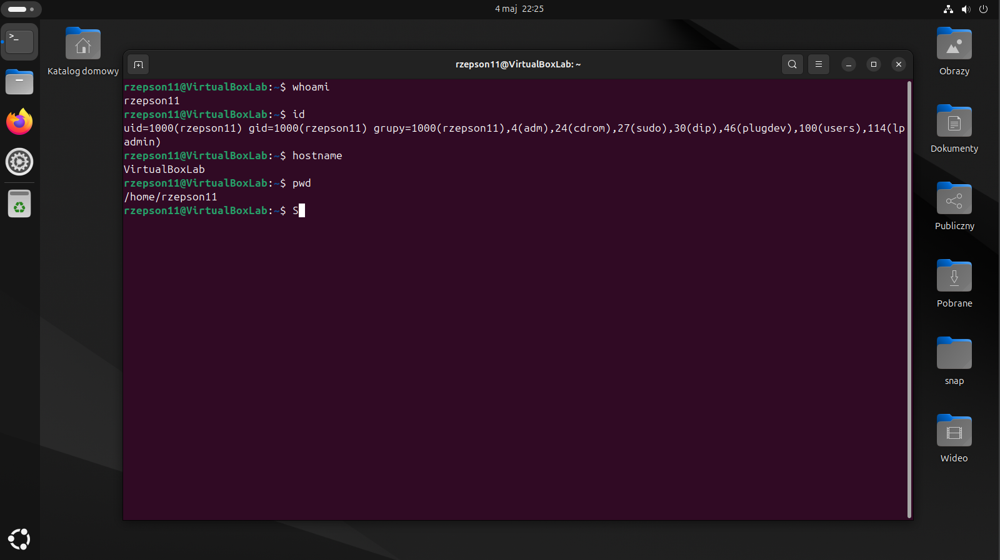

# Linux System Analysis

## Cel

Celem projektu była podstawowa analiza systemu Linux z perspektywy cyberbezpieczeństwa. Skupiłem się na identyfikacji użytkowników, procesów, usług oraz potencjalnych punktów analizy w systemie.

---

## Środowisko

- System: Linux (VM)
- Dostęp: lokalny terminal

---

## Analiza systemu

### Informacje o systemie

Sprawdziłem podstawowe informacje o użytkowniku i systemie:

```bash
whoami
id
hostname
pwd
```



---

### Użytkownicy

Przeanalizowałem listę użytkowników:

```bash
cat /etc/passwd
```

Pozwala to zidentyfikować konta systemowe oraz potencjalnie podejrzanych użytkowników.


---

### Uprawnienia i pliki

Sprawdziłem uprawnienia plików:

```bash
ls -la
```

Pozwala to wykryć nieprawidłowe konfiguracje dostępu.


---

### Procesy

Wyświetliłem wszystkie procesy:

```bash
ps aux
```

Dzięki temu można zidentyfikować podejrzane aplikacje działające w systemie.


---

### Obciążenie systemu

```bash
top
```

Pozwala zobaczyć najbardziej obciążające procesy.


---

### Porty i połączenia

```bash
ss -tuln
```

Sprawdziłem otwarte porty oraz usługi nasłuchujące.


---

### Logi systemowe

```bash
cat /var/log/syslog | tail
```

Logi są kluczowe w analizie incydentów bezpieczeństwa.


---

### Historia poleceń

```bash
history
```

Pozwala przeanalizować działania użytkownika.


---

## Wnioski

Podczas analizy systemu:

- zidentyfikowałem użytkowników systemowych  
- przeanalizowałem aktywne procesy  
- sprawdziłem otwarte porty  
- przejrzałem logi systemowe  

System nie wykazywał oczywistych oznak nieautoryzowanej aktywności, jednak powyższe kroki stanowią podstawę analizy bezpieczeństwa systemu Linux.

---

## Podsumowanie

Projekt pozwolił mi przećwiczyć podstawową analizę systemu Linux z perspektywy cyberbezpieczeństwa. Zdobyte umiejętności stanowią fundament do dalszej nauki w kierunku SOC Analyst oraz Incident Response.
