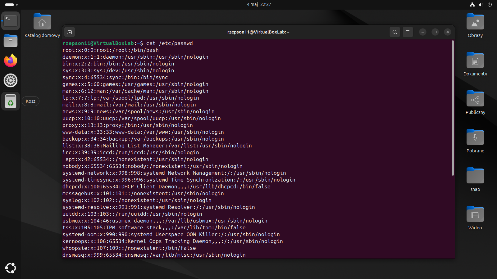
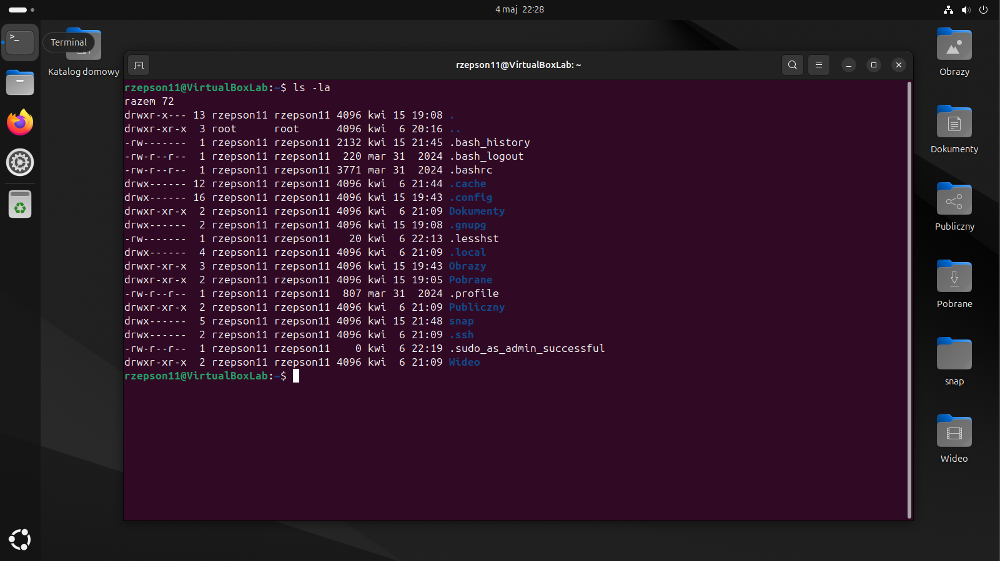
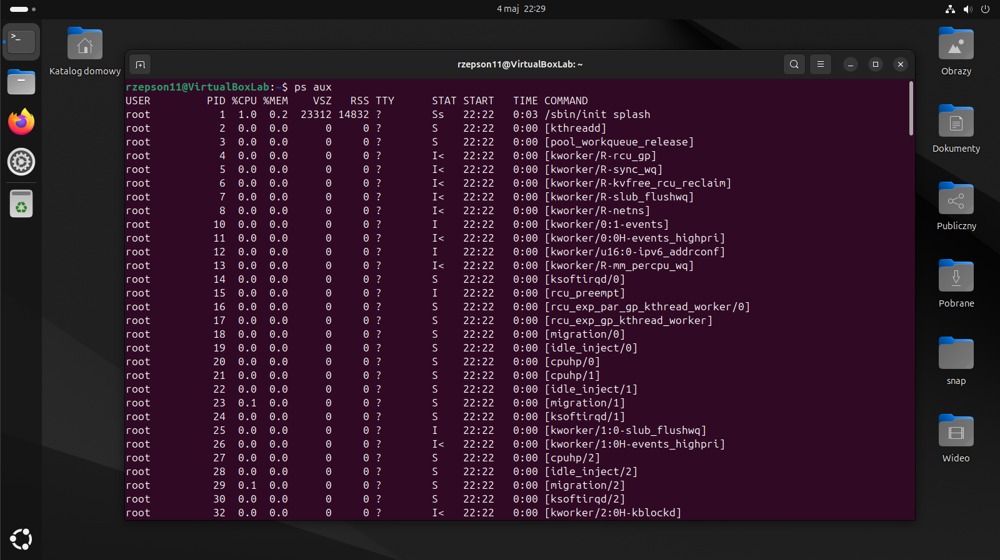
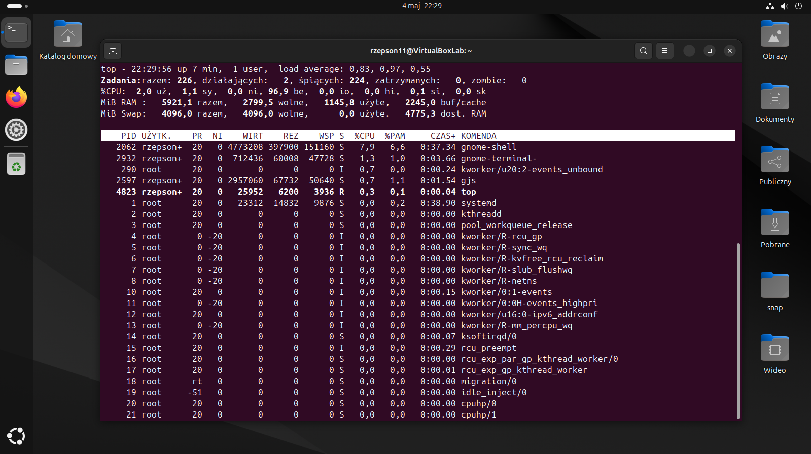
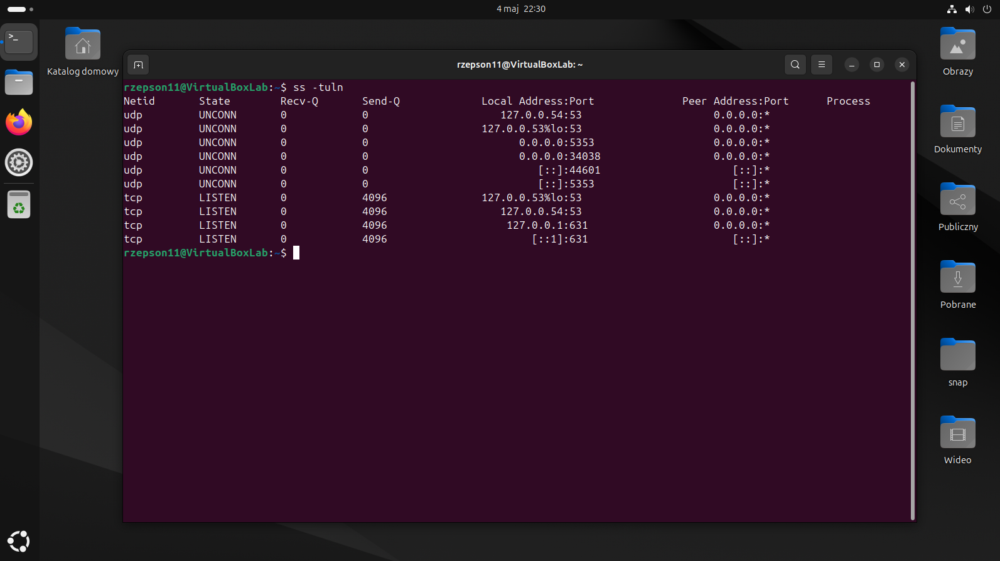
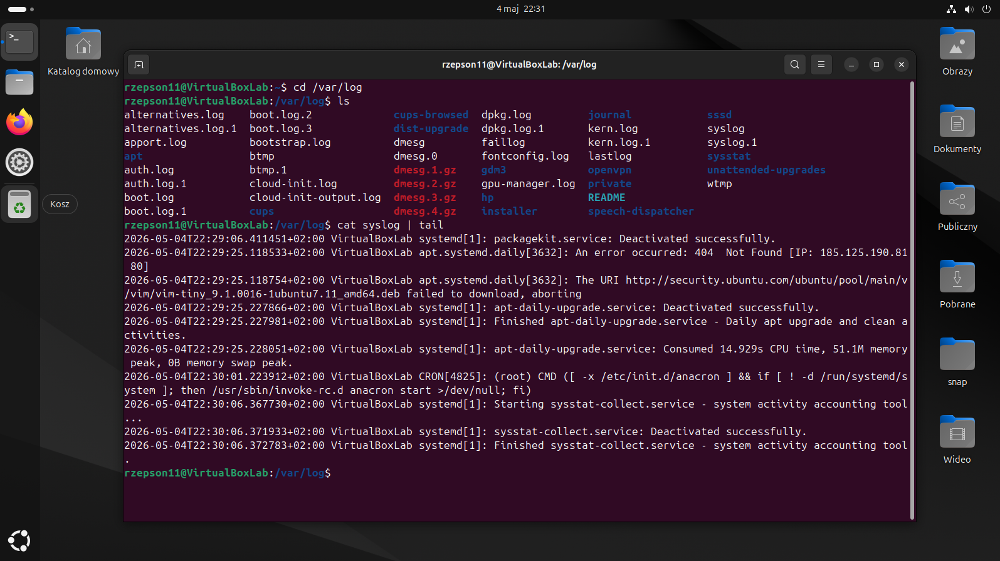
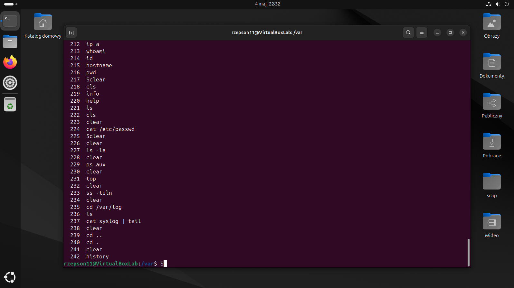

# Linux System Analysis

## Cel

Celem projektu była podstawowa analiza systemu Linux z perspektywy cyberbezpieczeństwa. Skupiłem się na identyfikacji użytkowników, procesów, usług oraz potencjalnych punktów analizy w systemie.

Projekt odzwierciedla podstawowe działania wykonywane przez analityka SOC podczas wstępnej analizy systemu po potencjalnym incydencie.

---

## Środowisko

- System: Linux (VM)
- Dostęp: lokalny terminal

---

## Analiza systemu

### Informacje o systemie

Sprawdziłem podstawowe informacje o użytkowniku oraz środowisku systemowym:

```bash
whoami
id
hostname
pwd
```

Na podstawie wyników potwierdziłem aktualnego użytkownika oraz kontekst pracy w systemie.


---

### Użytkownicy

Przeanalizowałem listę użytkowników systemowych:

```bash
cat /etc/passwd
```

Zidentyfikowałem standardowe konta systemowe (np. root, daemon, systemd) oraz konto użytkownika.

Nie zaobserwowałem podejrzanych ani niestandardowych kont, które mogłyby wskazywać na nieautoryzowany dostęp.



---

### Uprawnienia i pliki

Sprawdziłem uprawnienia plików w bieżącym katalogu:

```bash
ls -la
```

Pozwoliło to zweryfikować dostęp do plików oraz wykryć potencjalnie niebezpieczne konfiguracje (np. nadmierne uprawnienia).

Nie zaobserwowano plików z podejrzanymi uprawnieniami.



---

### Procesy

Wyświetliłem wszystkie aktywne procesy:

```bash
ps aux
```

Analiza procesów pozwoliła na identyfikację uruchomionych usług oraz aplikacji.

Nie zauważono procesów o podejrzanych nazwach ani nadmiernym wykorzystaniu zasobów.



---

### Obciążenie systemu

Sprawdziłem obciążenie systemu w czasie rzeczywistym:

```bash
top
```

Monitorowanie pozwala szybko wykryć procesy zużywające nadmierne zasoby CPU lub RAM.

System działał stabilnie, bez anomalii wydajnościowych.



---

### Porty i połączenia

Sprawdziłem otwarte porty oraz usługi nasłuchujące:

```bash
ss -tuln
```

Pozwoliło to określić, które usługi są dostępne z sieci.

Nie wykryto nietypowych ani nieznanych portów mogących wskazywać na złośliwe oprogramowanie.



---

### Logi systemowe

Przeanalizowałem ostatnie wpisy logów systemowych:

```bash
cat /var/log/syslog | tail
```

Logi są kluczowym źródłem informacji podczas analizy incydentów.

Nie zaobserwowano błędów ani wpisów sugerujących próby nieautoryzowanego dostępu.



---

### Historia poleceń

Sprawdziłem historię poleceń użytkownika:

```bash
history
```

Pozwala to przeanalizować działania wykonywane w systemie.

Nie wykryto podejrzanych lub nietypowych poleceń.



---

## Wnioski

Podczas analizy systemu:

- zidentyfikowałem użytkowników systemowych i zweryfikowałem brak podejrzanych kont  
- przeanalizowałem aktywne procesy i nie wykryłem anomalii  
- sprawdziłem otwarte porty — brak nieznanych usług  
- przejrzałem logi systemowe — brak oznak naruszenia  
- zweryfikowałem historię poleceń użytkownika  

System nie wykazywał oznak kompromitacji ani nieautoryzowanej aktywności.

---

## Potencjalne zagrożenia

Mimo braku wykrytych anomalii, podczas analizy warto zwrócić uwagę na:

- możliwość ukrywania procesów przez rootkity  
- nieautoryzowane zmiany w logach systemowych  
- usługi nasłuchujące na nietypowych portach  
- błędne konfiguracje uprawnień plików  
- aktywność w katalogach takich jak `/tmp`  

---

## Znaczenie w cyberbezpieczeństwie

Przeprowadzona analiza odzwierciedla podstawowe działania wykonywane przez:

- Junior SOC Analyst  
- Incident Responder  
- Blue Team Specialist  
- System Administrator  

Umiejętność analizy systemu Linux jest kluczowa podczas wykrywania zagrożeń oraz reagowania na incydenty.

---

## Podsumowanie

Projekt pozwolił mi przećwiczyć podstawową analizę systemu Linux w praktyce.

Zdobyte umiejętności stanowią fundament do dalszej nauki w kierunku:

- SOC Analyst  
- Incident Response  
- Digital Forensics  

oraz pracy z bardziej zaawansowanymi narzędziami bezpieczeństwa.
