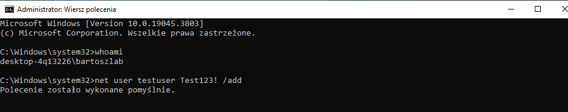
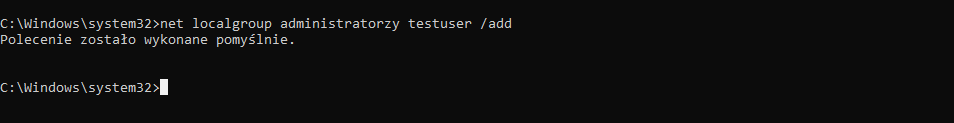
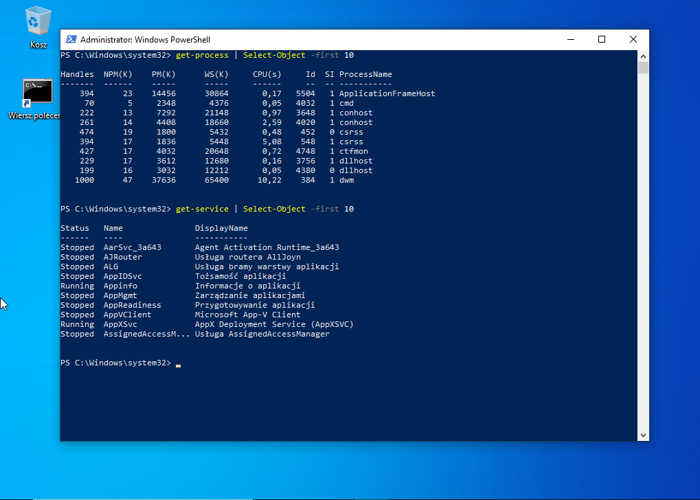
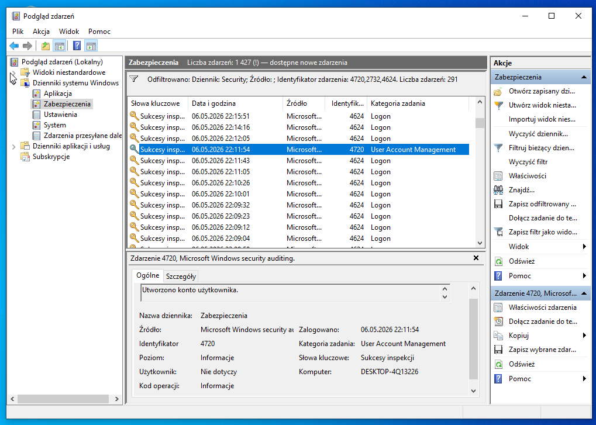
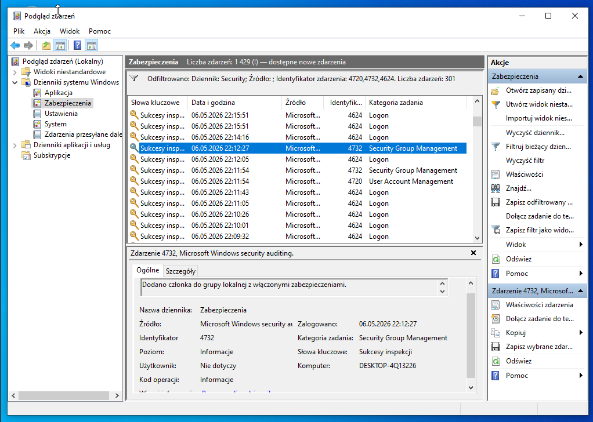
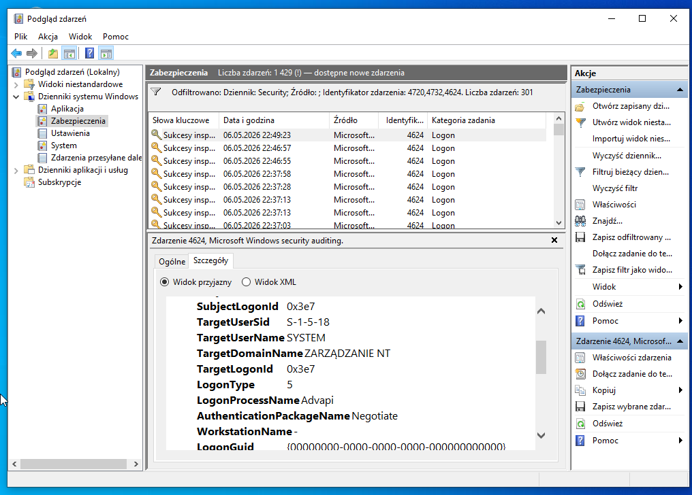

# Windows Log Analysis (SOC Simulation)

## Cel

Celem projektu była symulacja podejrzanej aktywności w systemie Windows oraz analiza logów systemowych z perspektywy analityka SOC.

Projekt odzwierciedla podstawowy scenariusz bezpieczeństwa, w którym dochodzi do utworzenia nowego użytkownika oraz nadania mu uprawnień administratora.

---

## Środowisko

- System: Windows 10 (VM)
- Narzędzia: CMD, PowerShell, Event Viewer

---

## Scenariusz

Podczas analizy systemu wykryto sekwencję zdarzeń sugerujących potencjalne naruszenie bezpieczeństwa:

- utworzenie nowego lokalnego użytkownika  
- dodanie użytkownika do grupy administratorów  
- aktywność w PowerShell  

Tego typu działania mogą wskazywać na próbę uzyskania nieautoryzowanego dostępu oraz eskalację uprawnień w systemie.

---

## Symulacja aktywności

### Utworzenie użytkownika (administrator)

Uruchomiono CMD jako administrator i wykonano:

```cmd
net user testuser Test123! /add
```



---

### Nadanie uprawnień administratora

```cmd
net localgroup administrators testuser /add
```



---

### Aktywność użytkownika (PowerShell)

```powershell
Get-Process
Get-Service
```



---

## Analiza logów

Do analizy wykorzystano:

```plaintext
Event Viewer → Windows Logs → Security
```

---

### Utworzenie użytkownika

```plaintext
Event ID: 4720
```

Event ID 4720 wskazuje na utworzenie nowego konta użytkownika. 

W kontekście bezpieczeństwa jest to zdarzenie istotne, ponieważ nieautoryzowane tworzenie kont może oznaczać próbę uzyskania dostępu do systemu przez atakującego.



---

### Dodanie do grupy administratorów

```plaintext
Event ID: 4732
```

Event ID 4732 wskazuje na dodanie użytkownika do uprzywilejowanej grupy.

Jest to krytyczne zdarzenie bezpieczeństwa, ponieważ może oznaczać eskalację uprawnień i przejęcie kontroli nad systemem.



---

### Logowanie użytkownika

```plaintext
Event ID: 4624
```

Event ID 4624 rejestruje udane logowanie do systemu.

W analizie incydentów kluczowe jest powiązanie tego zdarzenia z wcześniejszym utworzeniem konta, co może wskazywać na wykorzystanie nowego użytkownika do uzyskania dostępu.



---

## Wnioski

Podczas analizy:

- zidentyfikowano utworzenie nowego konta użytkownika  
- wykryto nadanie uprawnień administratora  
- przeanalizowano logowanie użytkownika w systemie  

Sekwencja zdarzeń (utworzenie konta → nadanie uprawnień → logowanie) stanowi wzorzec często obserwowany podczas kompromitacji systemów.

Takie działania mogą wskazywać na próbę utrzymania trwałego dostępu (persistence) przez atakującego.

---

## Potencjalne zagrożenia

- tworzenie nieautoryzowanych kont użytkowników  
- nadawanie uprawnień administratora  
- aktywność użytkowników o wysokich uprawnieniach  
- brak kontroli nad zmianami w systemie  

---

## Znaczenie w cyberbezpieczeństwie

Projekt odzwierciedla podstawowe działania wykonywane przez:

- Junior SOC Analyst  
- Incident Responder  
- Blue Team  

Analiza logów systemowych jest kluczowa w wykrywaniu incydentów bezpieczeństwa oraz nieautoryzowanych działań.

---

## Korelacja zdarzeń

Analiza wykazała powiązanie między następującymi zdarzeniami:

1. Event ID 4720 – utworzenie nowego konta  
2. Event ID 4732 – nadanie uprawnień administratora  
3. Event ID 4624 – logowanie użytkownika  

Taka sekwencja może wskazywać na scenariusz, w którym atakujący:

- tworzy konto użytkownika  
- podnosi jego uprawnienia  
- uzyskuje dostęp do systemu  

Korelacja zdarzeń jest kluczowym elementem pracy analityka SOC, ponieważ pojedyncze logi często nie wskazują jednoznacznie na incydent.

## Podsumowanie

Projekt pozwolił przećwiczyć:

- symulację aktywności użytkownika  
- analizę logów Windows  
- identyfikację zdarzeń bezpieczeństwa  

Stanowi podstawę do dalszej nauki analizy incydentów oraz pracy w środowisku SOC.
