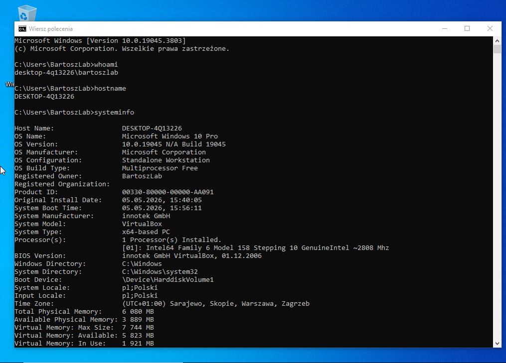
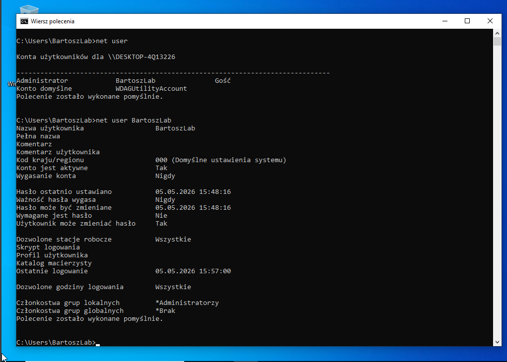
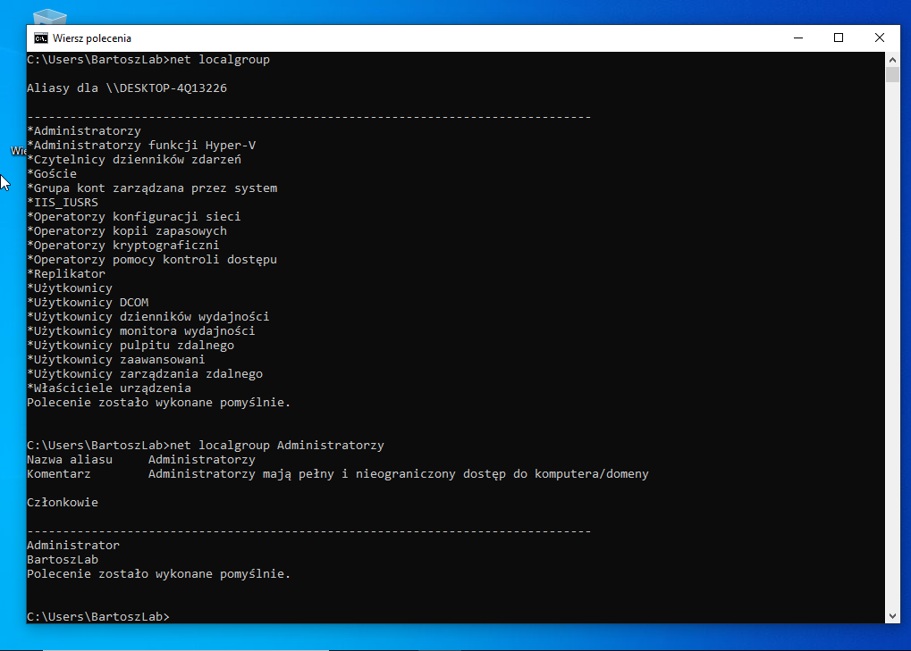
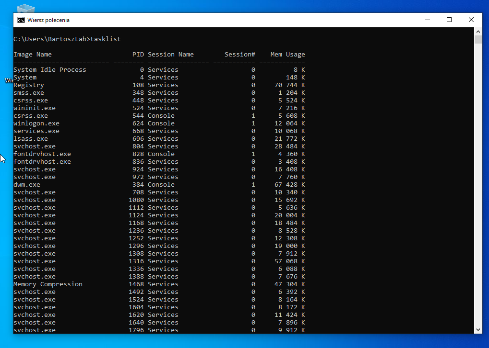
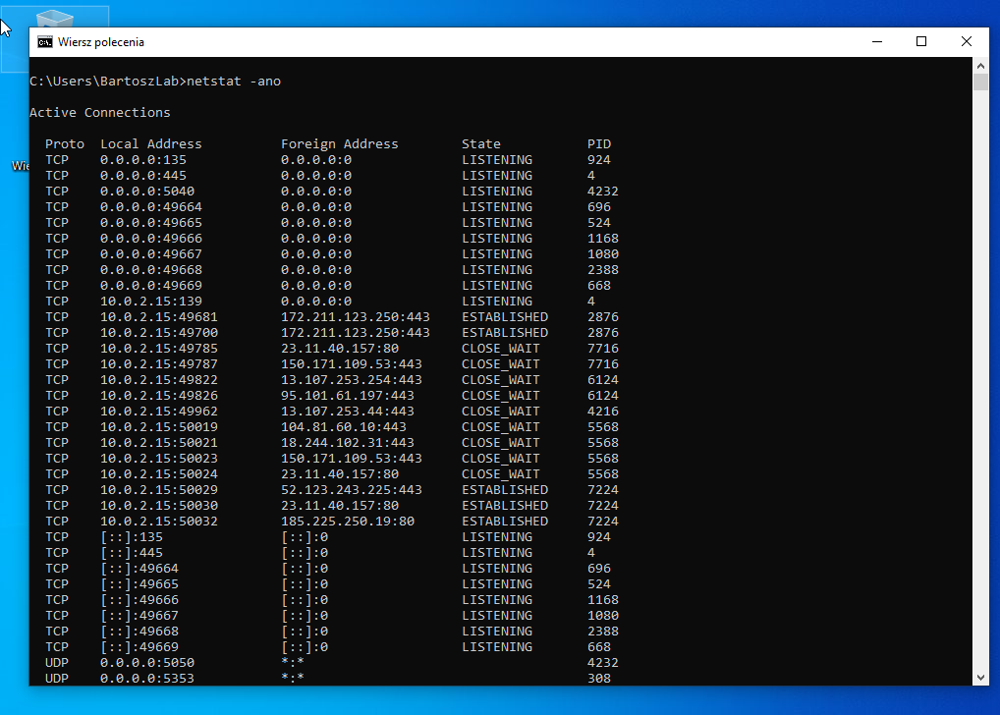
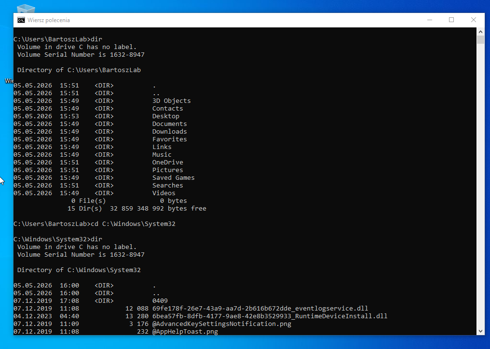
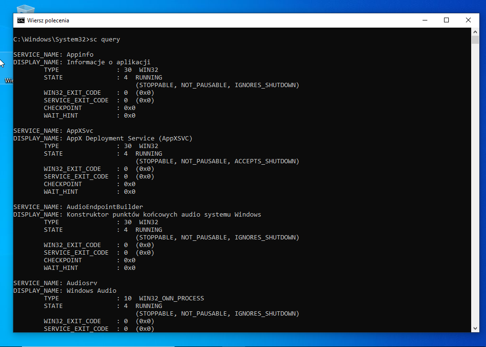
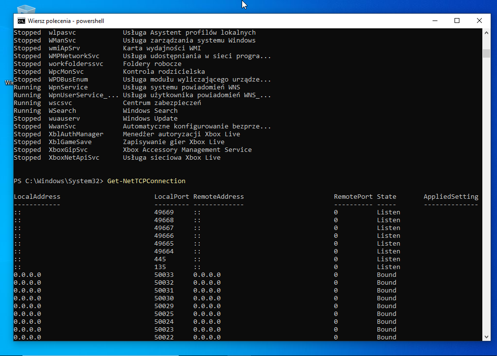

# Windows System Analysis

## Cel

Celem projektu była analiza systemu Windows z perspektywy cyberbezpieczeństwa. Skupiłem się na identyfikacji użytkowników, procesów, usług oraz aktywnych połączeń sieciowych.

Projekt odzwierciedla podstawowe działania wykonywane przez analityka SOC podczas wstępnej analizy systemu.

---

## Środowisko

- System: Windows (VM)
- Narzędzia: CMD, PowerShell

---

## Analiza systemu

### Informacje o systemie

```cmd
whoami
hostname
systeminfo
```

Pozwala określić użytkownika, nazwę hosta oraz szczegóły systemu.



---

### Użytkownicy

```cmd
net user
net user <username>
```

Zidentyfikowano użytkowników systemowych oraz ich konfigurację.



---

### Grupy i uprawnienia

```cmd
net localgroup
net localgroup Administratorzy
```

Pozwala określić, którzy użytkownicy posiadają uprawnienia administracyjne.



---

### Procesy

```cmd
tasklist
```

Analiza aktywnych procesów pozwala wykryć podejrzane aplikacje.



---

### Połączenia sieciowe

```cmd
netstat -ano
```

Pozwala sprawdzić aktywne połączenia oraz powiązane procesy (PID).



---

### System plików

```cmd
dir
cd C:\Windows\System32
dir
```

Pozwala na analizę struktury plików systemowych.



---

### Usługi

```cmd
sc query
```

Lista usług systemowych pozwala wykryć nieautoryzowane komponenty.



---

### PowerShell

```powershell
Get-Process
Get-Service
Get-NetTCPConnection
```

PowerShell umożliwia bardziej zaawansowaną analizę systemu.



---

## Wnioski

Podczas analizy:

- zidentyfikowano użytkowników systemowych  
- przeanalizowano aktywne procesy  
- sprawdzono połączenia sieciowe  
- zweryfikowano usługi systemowe  

Nie wykryto oczywistych oznak kompromitacji systemu.

---

## Potencjalne zagrożenia

- podejrzane procesy działające w tle  
- nieznane połączenia sieciowe  
- usługi uruchomione bez wiedzy administratora  
- użytkownicy z nadmiernymi uprawnieniami  

---

## Znaczenie w cyberbezpieczeństwie

Projekt odzwierciedla podstawowe działania:

- Junior SOC Analyst  
- Incident Responder  
- Blue Team  

---

## Podsumowanie

Projekt pozwolił przećwiczyć analizę systemu Windows z perspektywy bezpieczeństwa.

Stanowi fundament do dalszej nauki Active Directory oraz analizy incydentów.
